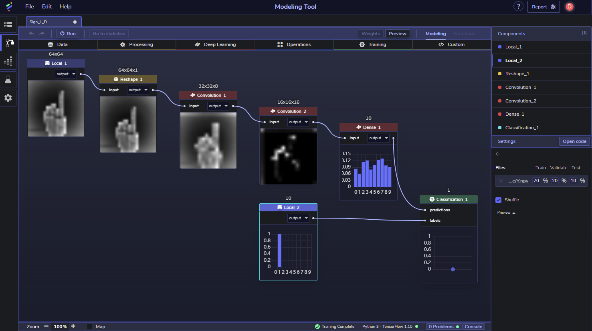
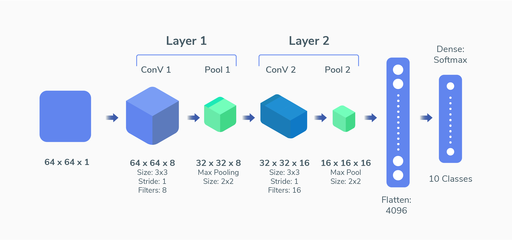

​
# PerceptiLabs Community Model
​
Sign language has been used for centuries to help the hearing impaired to communicate. It's composed of various hand gestures and even body movements to represent the information to convey. 
​ 
This repo contains a machine learning model that you can load in PerceptiLabs that learns to identify pictures of hand signs representing the digits 0 to 9.
​  
**Note:** This model is not compatible with PerceptiLabs 0.12 as the UI and components have changed.

​
The model follows the [LeNet](https://en.wikipedia.org/wiki/LeNet) approach and consists of two Convolution (ConV) layers followed by a Dense layer. While both of the ConV layers use [Relu](https://en.wikipedia.org/wiki/Rectifier_(neural_networks)) activation functions, the Dense layer uses a [Softmax](https://en.wikipedia.org/wiki/Softmax_function) function and is passed through to a Classification training component. The model also makes use of pooling which is configured via the ConV components. 
​
The architecture of this model is illustrated here:
​

​
# How A ConV Layer Works 
​
A ConV neural network is a deep learning algorithm that has the ability to learn from an input image through a number of filters and an activation function for that layer. In other words, when a user loads an image, the ConV layers try to learn from different features in that image. These features may be vertical edges, horizontal edges, different colors in the image, lines, etc. 
​ 
After convolution is performed, the image is subsequently fed to a Pooling layer. The goal of pooling is to downsample the feature maps (i.e., the outputs) from the previous step and to summarize the results before feeding them to the next layer. There are two types of pooling methods: average and max pooling. For this tutorial, we will use max pooling in which a feature map is divided into a grid of values. The feature map is then partitioned into regions of values from which the maximum value is chosen from each. 
​
# Structure
​
This repo contains the following files:
​
* **model.json**: the PerceptiLabs model file.
* **data.zip**: contains the model's data files:
  * **X.npy**: contains images of various sign language hand poses.
  * **Y.npy**: contains the labels which correspond to the sign language images in X.npy.
​
# Installation 
​
Follow the steps below to load the sample model in PerceptiLabs:
​
1. Choose one of the following options to obtain this repo:
​
  * Clone or download the sample model from GitHub. Note that This model is not compatible with PerceptiLabs 0.12 as the UI and components have changed. Then on the **ModelHub** screen in Perceptilabs, import the sample model. When prompted for the model's folder, navigate to and select the location of the **model.json** file.
  * Clone the repo directly from within PerceptiLabs, by selecting PerceptiLabs' **File** > **Import Model** menu, and then populating the **GitHub** tab on the popup with the URL of this repo.
​
2. Unzip **data.zip**. This will create a subdirectory named **data** containing the repo's two .npy data files (**X.npy** and **Y.npy**).
3. Click on the model's topmost Data component and use the settings pane to assign **X.npy** (image data) to it.
4. Click on the model's bottom Data component and use the settings pane to assign **Y.npy** (label data) to it.
​
# Community
​
Got questions, feedback, or want to join a community of machine learning practitioners working with exciting tools and projects? Check out our [forum](http://forum.perceptilabs.com/) and [Slack Channel](https://perceptilabs-com.slack.com/join/shared_invite/enQtODQ5NzAwNDkxOTExLWUxODAwZDk0MzA1MmM4OTViNWE4MmVjYjc2OTQwMTQ4N2NmM2ZlYmI5NjZjOWRiYjBkYjBjMTMzNjEyMDNiNDk)!
